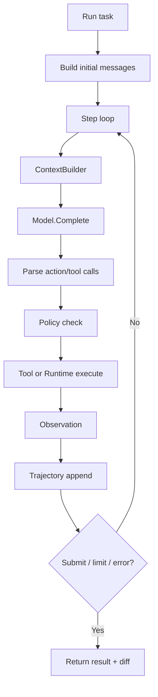
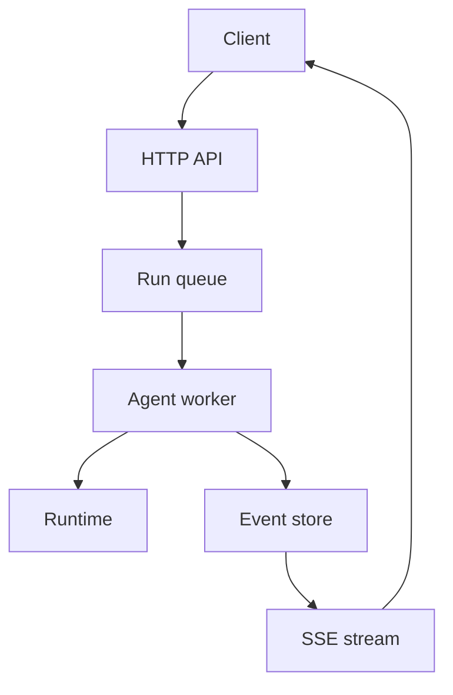

# Go 语言 SWE Agent 实现设计

更新时间：2026-06-24

本文把 `swe-agent-architecture-options.md` 中的通用架构落到 Go 语言实现。目标不是一次性做完整 OpenHands/Cline 平台，而是先实现一个稳定、可测试、可扩展的 Go CLI agent 内核，再逐步扩展到工具系统、sandbox、事件流和 server。

## 设计目标

第一阶段目标：

- 一个 Go CLI 可以在本地仓库里接受任务、读取上下文、执行动作、修改文件、跑测试、输出 diff。
- 主循环清晰：`task -> context -> model -> action -> runtime -> observation -> next step -> submit`。
- 所有 action/observation 都写入 trajectory，便于复盘和调试。
- 工具、模型、runtime 都通过接口隔离，后续可替换 provider、Docker、remote sandbox。

非目标：

- 第一版不做 Web UI。
- 第一版不做多租户 GitHub-compatible API。
- 第一版不做复杂 multi-agent team。
- 第一版不做完整 AST/fault localization，可以预留接口。

## 推荐目录结构

```text
swe-agent/
  go.mod
  cmd/
    sweagent/
      main.go
  internal/
    agent/
      agent.go
      config.go
      message.go
      result.go
    model/
      model.go
      openai.go
      anthropic.go
      litellm.go
      retry.go
    action/
      parser.go
      shell_parser.go
      tool_parser.go
    runtime/
      runtime.go
      local.go
      docker.go
      process.go
    tool/
      tool.go
      registry.go
      shell.go
      read_file.go
      apply_patch.go
      grep.go
      run_tests.go
    workspace/
      workspace.go
      git.go
      diff.go
      checkpoint.go
    context/
      builder.go
      repo_map.go
      grep.go
      snippets.go
    trajectory/
      store.go
      jsonl.go
      event.go
    policy/
      policy.go
      approvals.go
      redaction.go
      prompt_injection.go
    validation/
      runner.go
      summary.go
    server/
      app.go
      conversations.go
      events.go
  configs/
    default.yaml
  docs/
  tests/
```

这个结构保持三个边界：

- `agent` 只管主循环，不直接知道 OpenAI、Docker、Git 细节。
- `runtime` 只管执行，不理解业务任务。
- `tool` 只暴露受控能力，不直接拼 prompt。

## 核心接口

### Agent

```go
package agent

import "context"

type Agent struct {
    Model       Model
    Runtime     Runtime
    Tools       ToolRegistry
    Context     ContextBuilder
    Trajectory  TrajectoryStore
    Policy      Policy
    Config      Config
}

func (a *Agent) Run(ctx context.Context, task Task) (Result, error)
func (a *Agent) Step(ctx context.Context, state *State) error
```

职责：

- 初始化 system/user messages。
- 每轮调用 context builder 补充必要上下文。
- 调用 model 得到 action。
- 通过 action parser 转为 tool/runtime 调用。
- 写入 trajectory。
- 判断 step/cost/time/submit 退出条件。

### Model

```go
package agent

import "context"

type Model interface {
    Complete(ctx context.Context, req ModelRequest) (ModelResponse, error)
}

type ModelRequest struct {
    Messages    []Message
    Tools       []ToolSpec
    Temperature float64
    MaxTokens   int
}

type ModelResponse struct {
    Message      Message
    ToolCalls    []ToolCall
    Usage        Usage
    FinishReason string
}
```

设计要点：

- 统一 OpenAI/Anthropic/LiteLLM/本地模型差异。
- provider 特有字段放到 `ModelOptions map[string]any`，不要污染主接口。
- retry、rate limit、cost 统计包在 model adapter 外层。

### Runtime

```go
package agent

import "context"

type Runtime interface {
    Execute(ctx context.Context, req ExecRequest) (ExecResult, error)
    TemplateVars(ctx context.Context) map[string]string
    Close(ctx context.Context) error
}

type ExecRequest struct {
    Command string
    Cwd     string
    Env     map[string]string
    Timeout int
}

type ExecResult struct {
    Stdout   string
    Stderr   string
    Code     int
    TimedOut bool
}
```

实现：

- `LocalRuntime`：用 `exec.CommandContext`，适合开发。
- `DockerRuntime`：用 `docker exec` 或 Docker SDK，适合评测和生产。
- `RemoteRuntime`：后续可接 SSH、Kubernetes、Firecracker、Modal/Fargate。

Go 里要特别注意：

- `exec.CommandContext` 超时后要杀掉整个进程组，避免子进程残留。
- stdout/stderr 要限长，避免一次命令把 trajectory 打爆。
- runtime 不应继承完整 `os.Environ()`，至少需要可配置 allowlist。

### Tool

```go
package agent

type Tool interface {
    Spec() ToolSpec
    Risk() RiskLevel
    Execute(ctx context.Context, input ToolInput) (ToolResult, error)
}

type ToolSpec struct {
    Name        string
    Description string
    Schema      map[string]any
}

type ToolResult struct {
    Output    string
    Artifacts map[string]string
    Metadata  map[string]any
}

type RiskLevel string

const (
    RiskRead   RiskLevel = "read"
    RiskWrite  RiskLevel = "write"
    RiskExec   RiskLevel = "exec"
    RiskDanger RiskLevel = "danger"
)
```

第一批工具：

| Tool | 风险 | 职责 |
|---|---|---|
| `shell` | exec | 执行 shell 命令 |
| `read_file` | read | 读取文件片段 |
| `grep` | read | 搜索代码 |
| `list_files` | read | 列目录/文件 |
| `apply_patch` | write | 应用 unified diff |
| `run_tests` | exec | 执行测试命令并摘要失败 |
| `git_diff` | read | 查看当前改动 |
| `submit` | read | 标记任务完成 |

工具执行必须经过 `Policy`。

### Policy

```go
package agent

type Policy interface {
    AllowTool(ctx context.Context, call ToolCall, spec ToolSpec, risk RiskLevel) (Decision, error)
    FilterObservation(ctx context.Context, result ToolResult) ToolResult
    ValidateUserInput(ctx context.Context, input string) error
}

type Decision struct {
    Allowed bool
    Reason  string
}
```

策略：

- read 工具默认允许。
- write/exec 工具在交互模式下要求确认。
- headless 模式必须显式 `--auto-approve`。
- `rm -rf /`、写 `$HOME/.ssh`、读取 secret 文件等单独拦截。
- trajectory 前做 secret redaction。

## 主循环设计



伪代码：

```go
func (a *Agent) Run(ctx context.Context, task Task) (Result, error) {
    st := NewState(task)
    a.Trajectory.Append(ctx, EventUserTask(task))

    for st.ShouldContinue(a.Config) {
        if err := a.Step(ctx, st); err != nil {
            st.MarkError(err)
            break
        }
        if st.Submitted {
            break
        }
    }

    diff, _ := st.Workspace.Diff(ctx)
    return Result{
        Status: st.Status(),
        Answer: st.Submission,
        Diff:   diff,
        Usage:  st.Usage,
    }, nil
}
```

## Action 格式选择

Go 版本可以支持两种 action 格式：

### 方案 A：bash block

模型输出：

```text
THOUGHT: ...

```swe_shell
go test ./...
```
```

优点：

- 简单，模型兼容好。
- 可以快速复刻 mini-swe-agent。

缺点：

- 权限粒度粗。
- 文件编辑依赖 shell 命令。

### 方案 B：tool call

模型输出结构化 tool call：

```json
{
  "name": "apply_patch",
  "arguments": {
    "patch": "..."
  }
}
```

优点：

- 工具风险可控。
- UI/Server/Trajectory 更清晰。

缺点：

- provider 差异更大。
- 需要 tool schema 与 parser。

建议：

- MVP 支持 bash block。
- 第二阶段加 tool call。
- 内部统一转成 `ToolCall`，这样主循环不关心来源。

## Context Builder

Go 实现里不要一开始就上复杂 embedding。先做三层：

1. `GitContext`：当前 branch、dirty diff、最近提交。
2. `SearchContext`：根据 task 关键词 grep 文件。
3. `RepoMapContext`：文件树 + 顶层符号摘要。

接口：

```go
type ContextBuilder interface {
    Build(ctx context.Context, req ContextRequest) (ContextBlock, error)
}

type ContextRequest struct {
    Task       Task
    Messages   []Message
    Workspace  Workspace
    TokenBudget int
}

type ContextBlock struct {
    Text    string
    Sources []SourceRef
}
```

repo map 第一版可以很保守：

- Go：用 `go/parser` 提取 package、type、func、method。
- Python/JS/Rust：先用 tree-sitter 或退化为 regex。
- 大仓库只放 top N 文件和符号，避免污染上下文。

## Trajectory 与事件

第一版用 JSONL，方便流式写入：

```json
{"type":"user_task","task":"fix failing test","time":"..."}
{"type":"model_request","messages":12,"time":"..."}
{"type":"model_response","content":"...","usage":{"input":1234,"output":456}}
{"type":"tool_call","name":"shell","args":{"command":"go test ./..."}}
{"type":"tool_result","code":1,"output_head":"...","output_tail":"..."}
{"type":"final","status":"submitted","diff":"..."}
```

接口：

```go
type TrajectoryStore interface {
    Append(ctx context.Context, event Event) error
    Load(ctx context.Context, runID string) ([]Event, error)
}
```

后续 server 化时，JSONL event 可以自然迁移为 append-only event store。

## Workspace 与 Git

```go
type Workspace interface {
    Root() string
    Status(ctx context.Context) (GitStatus, error)
    Diff(ctx context.Context) (string, error)
    Checkpoint(ctx context.Context, label string) (CheckpointID, error)
    Rollback(ctx context.Context, id CheckpointID) error
}
```

实现策略：

- 本地开发：直接用现有工作区。
- 自动任务：每个任务创建独立 worktree。
- 多 agent 并发：每个 agent/card/issue 一个 worktree。
- checkpoint 可以先用 `git diff` patch 文件保存，后续再做轻量 commit 或 worktree snapshot。

## 配置格式

`configs/default.yaml`：

```yaml
agent:
  max_steps: 80
  max_cost_usd: 3.0
  wall_time_seconds: 3600
  action_mode: tool_call
model:
  provider: openai
  model: gpt-4.1
  temperature: 0.1
runtime:
  type: local
  timeout_seconds: 60
tools:
  enabled:
    - read_file
    - grep
    - apply_patch
    - shell
    - run_tests
policy:
  auto_approve_read: true
  auto_approve_write: false
  auto_approve_exec: false
trajectory:
  dir: trajectories
```

Go 解析建议：

- 用 `gopkg.in/yaml.v3`。
- config struct 带 `Validate()`。
- CLI flags 可以覆盖 YAML。

## CLI 设计

```bash
sweagent run --task "fix failing tests" --repo .
sweagent run --task-file issue.md --repo . --auto-approve
sweagent inspect trajectories/run-xxx.jsonl
sweagent replay trajectories/run-xxx.jsonl
sweagent tools list
sweagent config print
```

CLI 子命令：

| 命令 | 职责 |
|---|---|
| `run` | 执行单个任务 |
| `batch` | 批量 benchmark |
| `inspect` | 查看 trajectory |
| `replay` | 重放模型/工具轨迹 |
| `tools` | 列出工具与风险等级 |
| `config` | 打印合并后的配置 |

## Server 化扩展

当 CLI 稳定后，可以加 HTTP server：

```text
internal/server/
  app.go
  conversations.go
  events.go
  runs.go
  sandboxes.go
```

服务接口：

- `POST /runs` 创建任务。
- `GET /runs/{id}` 查询状态。
- `GET /runs/{id}/events` SSE 流式事件。
- `POST /runs/{id}/cancel` 取消。
- `GET /runs/{id}/diff` 获取 diff。



## 多 Agent 扩展

Go 里可以在第三阶段做一个轻量 orchestrator：

```go
type SubagentRole string

const (
    RoleResearcher SubagentRole = "researcher"
    RoleCoder      SubagentRole = "coder"
    RoleReviewer   SubagentRole = "reviewer"
    RoleTester     SubagentRole = "tester"
)

type Orchestrator interface {
    Delegate(ctx context.Context, req DelegateRequest) (DelegateResult, error)
}
```

策略：

- `researcher` 默认只读工具。
- `coder` 才能写文件。
- `reviewer` 只读 diff 和源码。
- 父 agent 只接收子 agent 最终报告，不接收完整 transcript。

## Go 实现注意点

### 并发与取消

- 所有接口都传 `context.Context`。
- model call、tool execution、runtime execution 都必须响应取消。
- batch 模式使用 worker pool，不能无限 goroutine。

### 日志与可观测性

- 用结构化日志，至少包含 `run_id`、`step`、`tool`、`duration`。
- trajectory 保存详细内容，普通日志只保存摘要。
- command output 必须 head/tail 截断。

### 安全

- 本地 runtime 禁止默认 auto-approve 写操作。
- Docker runtime 默认只挂载工作区。
- secrets 不进入 prompt，不进入 trajectory。
- `.git`、`.ssh`、`.env` 读取需要特殊策略。

### 测试

单元测试：

- `action.Parser`
- `tool.Registry`
- `runtime.LocalRuntime` timeout
- `trajectory.JSONLStore`
- `workspace.Diff/Checkpoint`

集成测试：

- 用临时 Git repo 跑一个固定任务。
- mock model 返回固定 tool calls。
- 验证最终 diff 和 trajectory。

端到端测试：

- 创建一个带 failing test 的小 Go module。
- agent 读取错误、修改文件、跑 `go test ./...`、submit。

## 推荐实现顺序

1. `cmd/sweagent` + config loader。
2. `agent.Agent` 主循环。
3. `model.MockModel` 和 `runtime.LocalRuntime`，先不接真实 LLM。
4. `trajectory.JSONLStore`。
5. `tool.Registry` + `shell/read_file/grep/apply_patch/run_tests`。
6. 接 OpenAI-compatible model adapter。
7. 加 workspace diff/checkpoint。
8. 加 Docker runtime。
9. 加 context builder/repo map。
10. 加 HTTP server 和 event stream。

## 最小验收标准

第一版 Go 实现完成时，应能通过这个流程：

```bash
sweagent run \
  --repo /tmp/example-go-project \
  --task "fix the failing unit test and keep behavior compatible" \
  --auto-approve
```

验收输出：

- `trajectories/<run_id>.jsonl`
- 最终 `git diff`
- 测试命令与结果摘要
- `status=submitted` 或明确失败原因

这比一开始实现完整平台更重要。只要 Go 内核的接口干净，后续接 Web UI、MCP、子 agent、GitHub issue runner、agent-git-service 都是增量工作。

