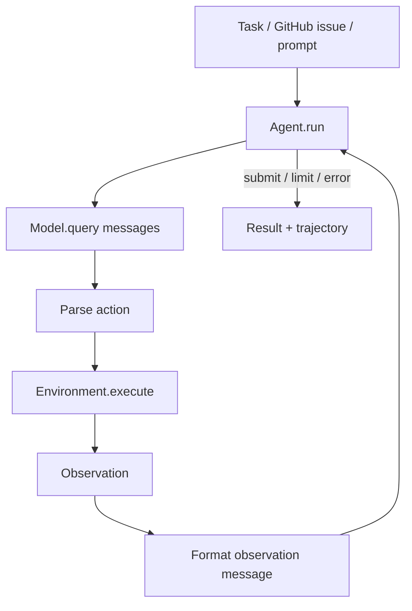
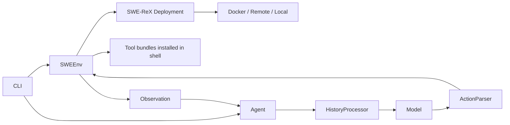
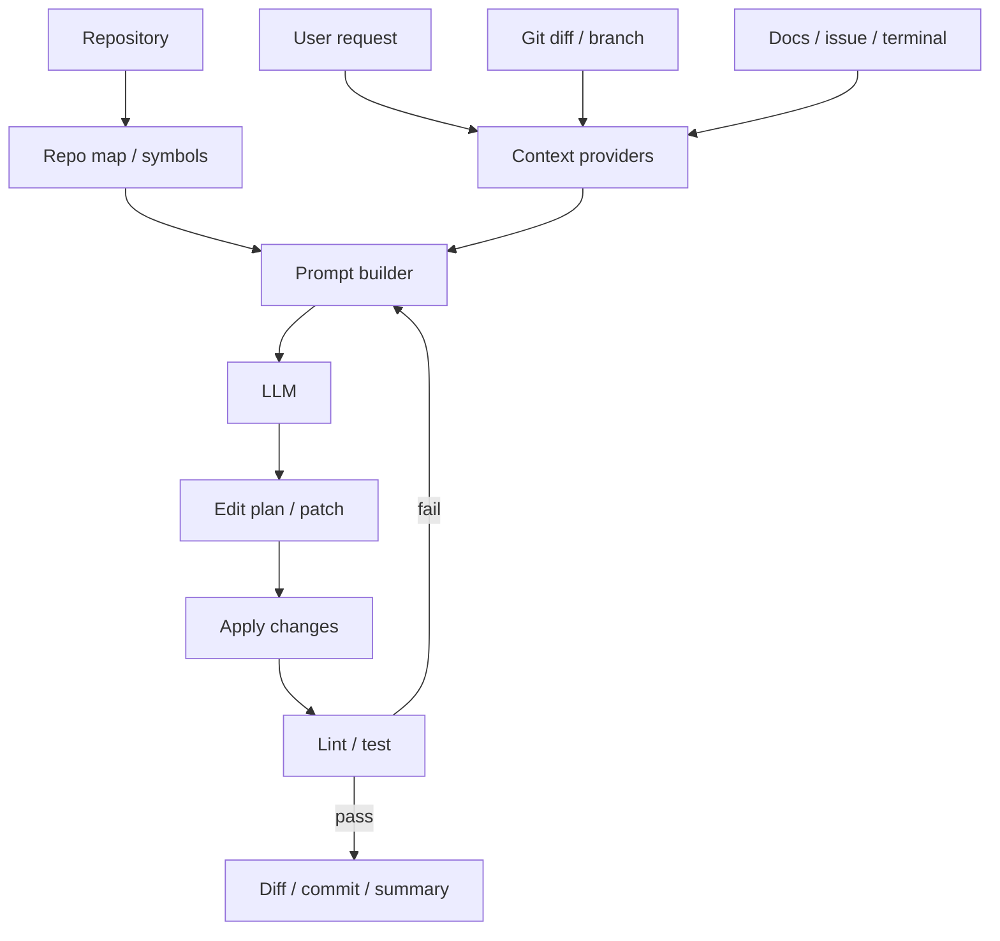
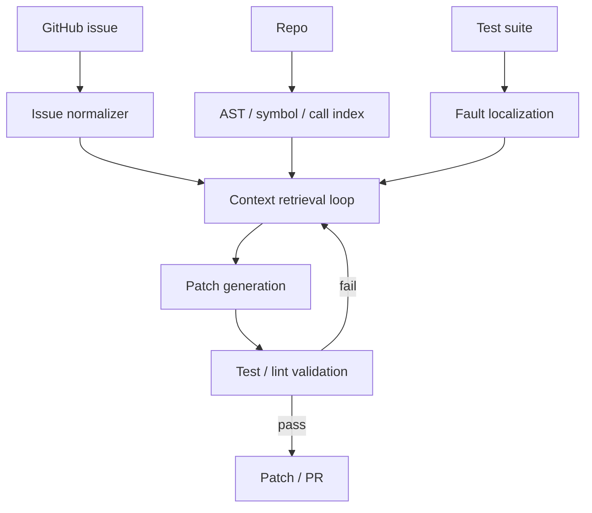
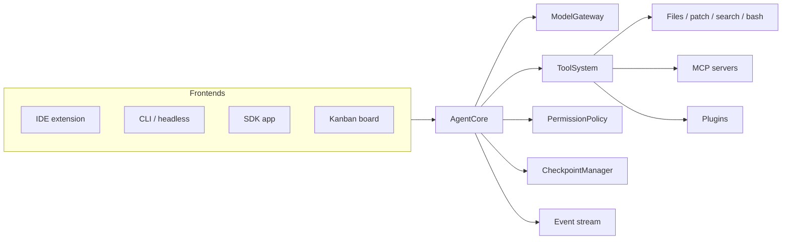
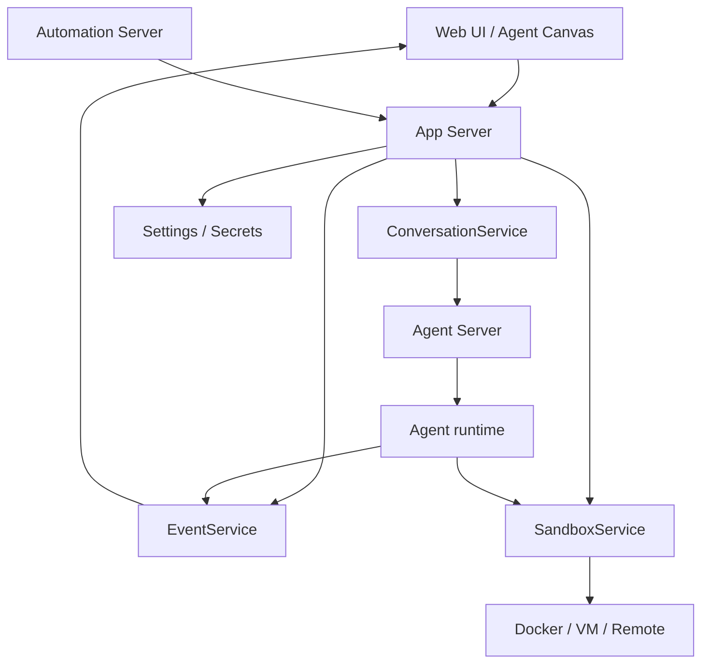
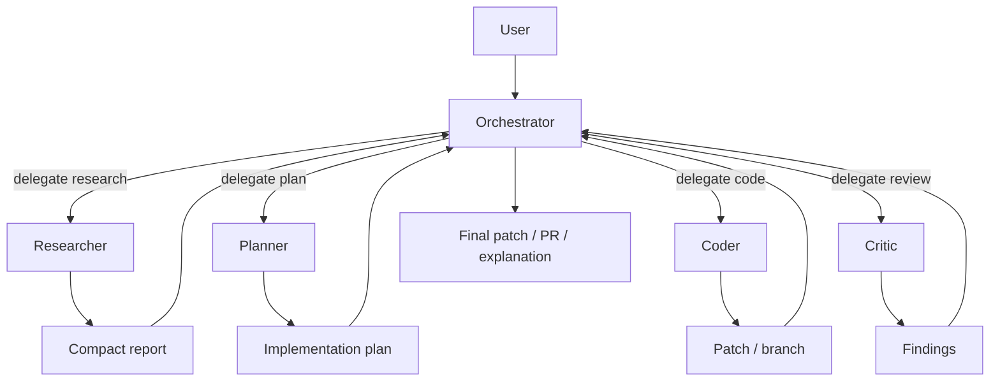
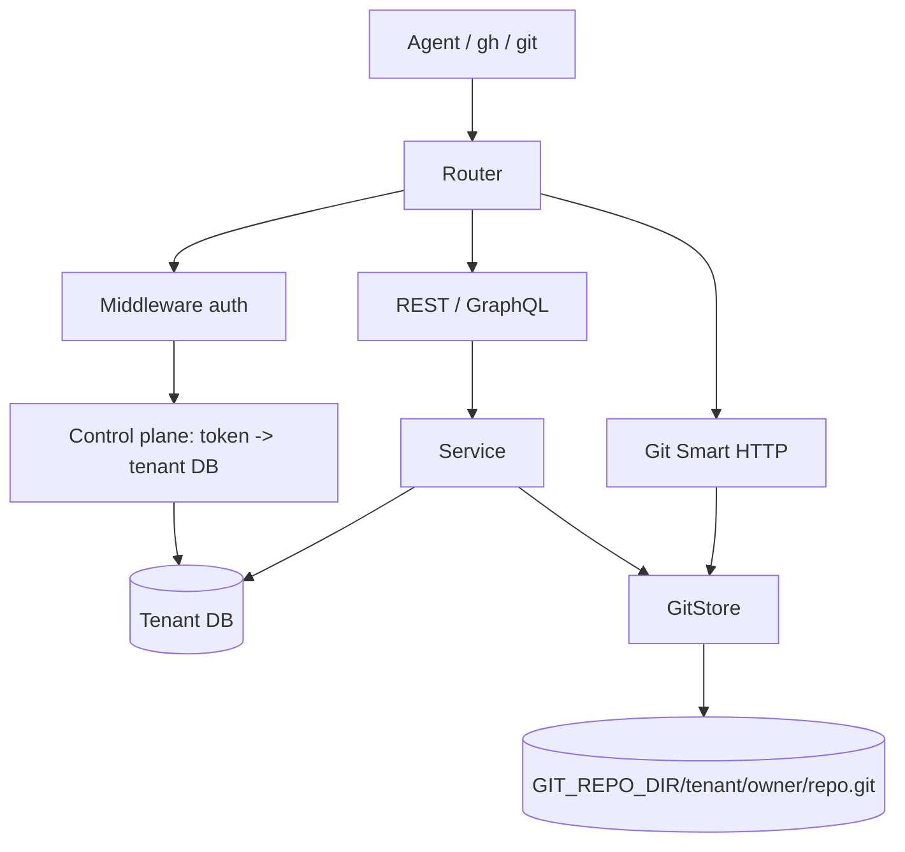
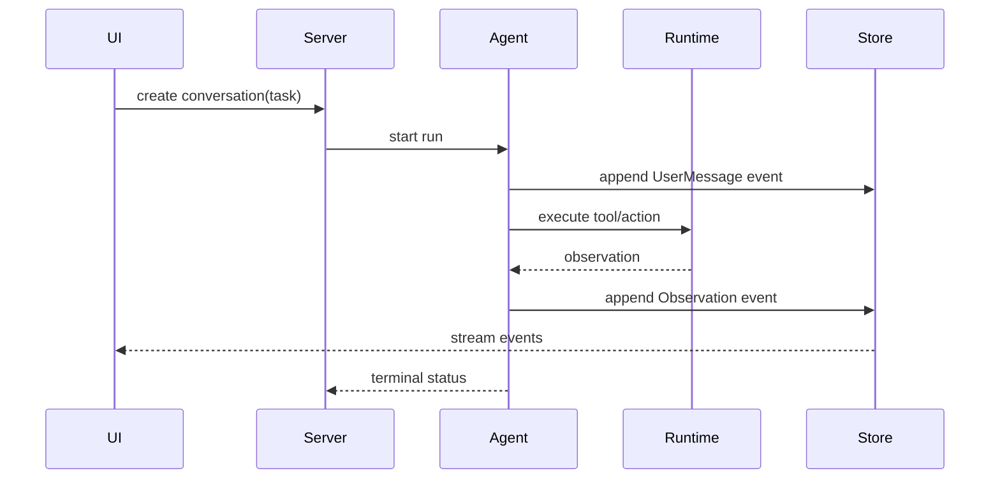

# SWE Agent 架构选型与模块设计

更新时间：2026-06-24

本文整理如果要实现一个 SWE agent，可以选择的几类架构、各模块职责、关键设计取舍和推荐落地路线。当前 `/root/workspace/swe-agent` 目录为空，因此本文同时参考了本地相邻仓库与公开 GitHub/官方文档。

如果选择 Go 语言实现，见配套落地文档：[go-swe-agent-implementation.md](go-swe-agent-implementation.md)。

## 参考资料

本地资料：

- `/root/workspace/mini-swe-agent`
- `/root/workspace/OpenHands`
- `/root/workspace/openhuman`
- `/root/workspace/agent-git-service`

外部资料：

- SWE-agent 官方文档与 GitHub：<https://swe-agent.com/latest/>，<https://github.com/swe-agent/swe-agent>
- mini-swe-agent GitHub：<https://github.com/SWE-agent/mini-swe-agent>
- OpenHands GitHub 与 SDK 文档：<https://github.com/OpenHands/OpenHands>，<https://docs.openhands.dev/sdk/arch/events>，<https://docs.openhands.dev/sdk/guides/agent-server/docker-sandbox>
- Aider GitHub 与 repo map 文档：<https://github.com/Aider-AI/aider>，<https://aider.chat/docs/repomap.html>
- AutoCodeRover GitHub 与论文：<https://github.com/AutoCodeRoverSG/auto-code-rover>，<https://arxiv.org/abs/2404.05427>
- Cline GitHub 与文档：<https://github.com/Cline/Cline>，<https://docs.cline.bot/sdk/overview>，<https://docs.cline.bot/tools-reference/all-cline-tools>
- Roo Code GitHub：<https://github.com/RooCodeInc/Roo-Code>
- Continue GitHub 与 context provider 文档：<https://github.com/continuedev/continue>，<https://docs.continue.dev/customize/custom-providers>
- GPT Engineer GitHub：<https://github.com/antonosika/gpt-engineer>

## 总体结论

实现 SWE agent 不是只有一种架构。可以从最小可用的本地 CLI agent 开始，也可以直接做成 OpenHands/Cline 这类平台化 agent runtime。实际选择取决于目标：

| 目标 | 推荐架构 | 典型参考 |
|---|---|---|
| 快速 MVP、跑本地修复、跑 benchmark | 极简单循环架构 | mini-swe-agent |
| 研究 agent-computer interface、工具接口、历史压缩 | ACI 工具束架构 | SWE-agent |
| 终端 pair programming、人工在环、持续编辑仓库 | Repo-aware pair programmer | Aider |
| 专注 GitHub issue 自动修复、定位补丁点 | 分析驱动 patcher | AutoCodeRover |
| IDE/CLI/SDK 多入口、审批、MCP、checkpoint | 应用型 agent core | Cline、Roo Code |
| Web UI、远程 sandbox、会话事件、自动化 | 事件驱动平台架构 | OpenHands |
| 多 specialist 并行/分工 | Orchestrator + subagents | OpenHuman、Cline teams |
| 多 agent 共享 GitHub-like 工作区 | Git 控制面基础设施 | agent-git-service |

我的建议是：先实现 mini-swe-agent 风格的最小内核，然后逐层加工具注册表、repo map、sandbox、事件日志、审批和多 agent。不要一开始就做完整平台，否则很容易把 agent loop、UI、sandbox、GitHub API、记忆系统和调度系统全部耦合在一起。

## 架构一：极简本地 CLI Agent

适用场景：

- 想快速做一个可跑的 SWE agent。
- 目标是单任务修复、SWE-bench、ProgramBench、CI 中自动尝试修复。
- 可接受主要工具只有 shell/bash。

核心思想：

- 线性消息历史。
- 每轮：LLM 生成一个 action，环境执行 action，把 observation 放回上下文。
- 不维护长生命周期 shell；每个 action 独立执行，便于 sandbox 与复现。
- 结束由特殊 submit 命令或 exit role 表示。

核心模块：

| 模块 | 职责 |
|---|---|
| `Agent` | 保存 messages、step/cost/time 限制，驱动 `query -> execute -> observe` 循环 |
| `Model` | 封装 LLM provider、动作解析、observation 格式化 |
| `Environment` | 执行命令，可选 local/docker/singularity/remote |
| `Config` | 系统提示词、任务模板、限制、输出路径 |
| `TrajectoryStore` | 保存完整 messages、cost、exit_status、submission |
| `Runner` | CLI、batch、benchmark 入口 |



设计要点：

- `Agent.step()` 只做一件事：`execute_actions(query())`。
- `Environment.execute()` 返回结构化结果：`stdout/stderr/returncode/timeout/exception`。
- `Model` 不应直接操作文件或 shell；它只负责消息格式和 provider。
- `Trajectory` 是调试、评测和训练数据的核心资产，必须默认保存。

缺点：

- 只有 shell 会导致文件编辑、搜索、patch 应用、测试归因都依赖模型自己写命令。
- 对大型代码库的上下文选择能力弱。
- 缺少人工审批与权限边界时风险较高。

## 架构二：SWE-agent ACI 工具束架构

适用场景：

- 研究不同工具接口、历史压缩、prompt/action parser 对能力的影响。
- 想让模型使用比 bash 更明确的 file viewer、editor、submit、search 工具。

核心思想：

- Agent-computer interface，简称 ACI：为 LM 设计更容易使用的命令与反馈格式。
- 环境由 SWEEnv/SWE-ReX 管理，可在 Docker、Modal、AWS、本机等后端执行。
- 工具以 tool bundle 组织，包含配置、可执行文件、安装脚本。
- 历史可通过 `HistoryProcessor` 压缩后送入模型。

核心模块：

| 模块 | 职责 |
|---|---|
| `CLI` | 初始化 run config、problem statement、repo、agent/env |
| `SWEEnv` | 管理部署和 shell session，安装工具 |
| `Deployment` | Docker/remote/local runtime 抽象 |
| `Agent` | `forward()` 主循环，调用模型、解析 action、执行 action |
| `ToolBundle` | 工具接口、文档、安装脚本、可执行命令 |
| `ActionParser` | 从模型输出中提取动作 |
| `HistoryProcessor` | 历史压缩、cache control、上下文管理 |
| `Trajectory` | 保存运行轨迹与补丁 |



设计要点：

- 工具必须有清晰的命令文档和错误反馈。
- 对交互式/危险命令做 filter 或 blocklist。
- `HistoryProcessor` 要避免破坏 provider 的 prompt cache。
- 工具和环境配置用 YAML 管理，方便实验。

缺点：

- 比极简架构复杂。
- 工具接口设计不当会让模型过拟合工具形态。
- 官方已建议新项目优先看 mini-swe-agent 思路。

## 架构三：Repo-aware Pair Programmer

适用场景：

- 终端/IDE 中与用户协作开发。
- 用户希望 agent 理解整个仓库，而不是只看手动贴进去的文件。
- 需要频繁编辑、测试、commit。

典型参考：Aider、Continue。

核心思想：

- repo map 或 context providers 负责把代码库压缩成 LLM 可读上下文。
- 用户显式选择文件、diff、issue、terminal 输出、docs 等上下文。
- agent 直接编辑文件，但通常保留人工确认或 git 自动提交能力。

核心模块：

| 模块 | 职责 |
|---|---|
| `RepoScanner` | 遍历文件、识别语言、过滤无关目录 |
| `RepoMap` | 提取类/函数/签名/关键行，按 token budget 渲染 |
| `ContextProvider` | `@file`、`@code`、`@diff`、`@terminal`、`@docs`、`@issue` |
| `Editor` | 生成 edit block、应用 patch、处理冲突 |
| `GitIntegration` | diff、commit、branch、revert |
| `LintTestLoop` | 修改后自动跑 lint/test，并把失败反馈给模型 |
| `ChatSession` | 人工对话、文件选择、上下文 pinning |



设计要点：

- repo map 不是搜索结果列表，而是可放入 prompt 的“结构摘要”。
- context provider 要可组合、可禁用、可审计。
- 自动 commit 可以作为 checkpoint，但不要强制。
- 对大型仓库，优先做符号级摘要，而不是全文索引全部塞给模型。

缺点：

- 更依赖上下文选择质量。
- 如果没有强 sandbox，直接编辑本地文件风险较高。
- 对完全无人值守的 GitHub issue 修复，还需要补充任务队列和验证系统。

## 架构四：分析驱动 Patch Agent

适用场景：

- 输入是 GitHub issue，输出是 patch。
- 重点是自动定位 bug/feature 修改点。
- 希望降低模型在大仓库里盲搜的成本。

典型参考：AutoCodeRover。

核心思想：

- 先做 context retrieval，再做 patch generation。
- 检索不只按文件文本，而是利用 AST、类/方法结构、测试失败、fault localization。
- LLM 通过代码搜索 API 逐步收集上下文，最后生成补丁。

核心模块：

| 模块 | 职责 |
|---|---|
| `IssueNormalizer` | 解析 issue、复现信息、测试提示 |
| `ProgramIndexer` | AST、类、方法、调用关系、符号索引 |
| `SearchAPI` | 给 LLM 使用的结构化检索工具 |
| `FaultLocalizer` | 基于测试或覆盖率定位可疑文件/方法 |
| `ContextRetriever` | 多轮检索并压缩相关上下文 |
| `PatchGenerator` | 根据检索上下文生成 patch |
| `PatchValidator` | 运行测试、比较失败、迭代修复 |



设计要点：

- 先定位再编辑，减少 token 和无关搜索。
- 搜索 API 应返回结构化结果：文件、符号、行号、摘要、相关性。
- 有测试时优先用测试失败栈和覆盖信息；无测试时退化到 grep/repo map。
- patch generation 与 validation 分离，便于替换模型。

缺点：

- 工程成本高于极简架构。
- 多语言 AST 支持很重。
- 对没有测试或 issue 描述很模糊的任务，定位收益下降。

## 架构五：IDE/CLI/SDK 应用型 Agent Core

适用场景：

- 既要 IDE extension，也要 CLI，也要 SDK 嵌入。
- 需要审批、checkpoint、MCP、skills、plugins、headless CI。
- 想做成可长期使用的开发者产品。

典型参考：Cline、Roo Code。

核心思想：

- 抽出共享 agent core，IDE/CLI/Kanban/SDK 都复用同一个核心。
- 工具分层：内置工具、MCP 工具、自定义插件工具。
- Plan/Act 模式把“讨论方案”和“真正改文件”分开。
- 所有高风险动作可审批或 auto-approve。

核心模块：

| 模块 | 职责 |
|---|---|
| `AgentCore` | 主循环、模型调用、工具调用、事件输出 |
| `ModelGateway` | 多 provider/model 路由 |
| `ToolSystem` | 内置工具、MCP、插件、自定义工具 |
| `PermissionPolicy` | 审批、auto-approve、禁用工具、YOLO 模式边界 |
| `CheckpointManager` | 每次编辑前后保存状态，可回滚 |
| `ModeManager` | Plan/Act/Code/Architect/Ask/Debug/Custom |
| `UIAdapters` | VS Code、JetBrains、CLI、TUI、Kanban |
| `RulesSkills` | `.clinerules`、skills、项目规则 |
| `Subagents` | 并行只读研究 agent 或多 agent team |



设计要点：

- 核心不要依赖某个 IDE；IDE 只是 adapter。
- 工具必须走统一 permission/policy。
- `Plan` 模式禁止写文件；`Act` 模式才允许修改。
- CLI headless 模式必须建议在干净分支运行。

缺点：

- 产品面广，状态复杂。
- 插件/MCP/审批/checkpoint/event 都会增加集成成本。
- 如果核心抽象不清，会变成 UI 与 agent loop 互相污染。

## 架构六：事件驱动 Agent Server 平台

适用场景：

- 要 Web UI、远程 agent server、团队共享后端。
- agent 可能运行在本机、Docker、VM、云端。
- 需要保存会话、事件流、sandbox 状态、settings、secrets、webhook automation。

典型参考：OpenHands。

核心思想：

- agent execution 由 Agent Server 管理。
- App Server 管理 conversation、event、sandbox、settings、secrets。
- Event 是 append-only log，同时作为 agent memory 和外部服务集成点。
- Sandbox 作为独立生命周期资源，支持 Docker/Remote/Local。

核心模块：

| 模块 | 职责 |
|---|---|
| `Frontend` | 会话 UI、任务面板、设置、事件展示 |
| `AppServer` | REST API 聚合层 |
| `AgentServer` | 运行 agent，会话执行 API |
| `ConversationService` | 会话创建、状态、分页、搜索、标题 |
| `EventService` | append-only typed events、查询、流式输出 |
| `SandboxService` | 创建、启动、停止、销毁 Docker/Remote sandbox |
| `FileStore` | 本地/S3/GCS 文件与 artifact |
| `SecretsStore` | LLM key、GitHub token、外部服务凭据 |
| `Settings` | LLM profile、agent config、conversation config |
| `AutomationServer` | 定时任务、webhook、Slack/GitHub/Linear 集成 |



设计要点：

- Event log 是系统核心，不要只把它当 UI 消息。
- Sandbox lifecycle 要可恢复、可查询、可清理。
- secrets 不应该进入 trajectory 或普通日志。
- Agent Server 与 App Server 分层，便于一个 UI 连接多个后端。

缺点：

- 初始复杂度最高。
- 要处理并发会话、权限、资源回收、运行时失败恢复。
- 不适合第一版 MVP。

## 架构七：Orchestrator + Subagents

适用场景：

- 任务复杂，需要“规划、调研、编码、测试、审查、发布”分工。
- 想让主 agent 保持上下文清洁，由子 agent 并行探索。
- 需要不同模型承担不同角色。

典型参考：OpenHuman、Cline subagents/teams。

核心思想：

- Orchestrator 不直接写代码，它负责路由、判断质量、合成结果。
- 子 agent 有自己的窄提示词、工具 allowlist、上下文窗口。
- 父 agent 不吸收子 agent 全部 transcript，只接收最终 compact result。
- 子 agent 可分 typed mode 与 fork mode：前者隔离更强，后者复用 prompt prefix。

核心模块：

| 模块 | 职责 |
|---|---|
| `AgentDefinitionRegistry` | 加载 agent.toml、prompt、模型、工具范围 |
| `Orchestrator` | 路由任务、调用 delegate tool、合成结果 |
| `DelegationTools` | `delegate_researcher`、`delegate_coder` 等合成工具 |
| `ParentExecutionContext` | provider、tools、memory、session lineage |
| `SubagentRunner` | 运行 typed/fork 子 agent inner loop |
| `ToolFilter` | 控制每个子 agent 可见和可执行工具 |
| `ResultHandoff` | 大结果缓存、摘要、渐进读取 |
| `TranscriptStore` | 父子 agent 独立轨迹 |



设计要点：

- 子 agent 默认只读，除非明确是 coder。
- 子 agent 返回“路径、证据、结论、下一步”，不要返回大段思考过程。
- 工具过滤既是 prompt-visible catalog，也是执行 allowlist。
- 并行 agent 要有预算、超时和取消机制。

缺点：

- token 和执行成本更高。
- 父子上下文边界设计不好，会重复工作或丢关键信息。
- 需要更强的 observability 才能调试。

## 架构八：GitHub-compatible Agent Git 控制面

适用场景：

- 有多个 agent，需要隔离账号、token、repo、issue、PR、review。
- 希望 agent 使用标准 `gh`、git clone/fetch/push、REST/GraphQL API。
- 需要自托管 GitHub-like 工作区，而不是直接用 GitHub.com。

典型参考：agent-git-service。

核心思想：

- Git 原生状态由裸 Git 仓库负责。
- Issue/PR/User/Review/Workflow 等元数据由关系数据库负责。
- service 层协调 DB 与 Git。
- 多 agent 模式下，control plane 做 token -> tenant DB 路由。
- 物理 Git 路径必须带 tenant，避免不同 agent 的 `owner/repo` 冲突。

核心模块：

| 模块 | 职责 |
|---|---|
| `router` | REST/GraphQL/Git HTTP/OAuth 路由 |
| `middleware` | token/basic auth、request guard |
| `controlplane` | agent identity、token、tenant DSN |
| `service` | 业务规则，协调 DB 与 Git |
| `db` | users、repos、issues、pull_requests、reviews、workflows |
| `gitstore` | bare repo、refs、merge、diff、archive、repo lock |
| `githttp` | Git Smart HTTP 到 `git-http-backend` |
| `oauth/auth0` | device flow、人类登录绑定 |
| `metrics/logging` | readiness、Prometheus、结构化日志 |



设计要点：

- `owner/repo` 是公共逻辑身份，不是多租户物理存储 key。
- Git 写操作需要 per-repo lock。
- merge/rebase 使用临时 clone 操作后 push 回 bare repo，更安全。
- REST/GraphQL handler 应保持薄层，业务规则放 service。

缺点：

- 这是基础设施，不是 agent loop。
- 如果只是做单机 agent，先不需要。
- GitHub API 兼容面很大，维护成本高。

## 通用模块拆分

无论选择哪种架构，一个完整 SWE agent 最终都会收敛到这些模块：

| 模块 | 必要性 | 说明 |
|---|---:|---|
| `TaskInput` | 必选 | CLI prompt、GitHub issue、PR comment、benchmark instance |
| `WorkspaceManager` | 必选 | clone/checkout/worktree/cwd/env/dirty state |
| `ContextEngine` | 必选 | grep、repo map、AST、docs、terminal、issue、memory |
| `PromptBuilder` | 必选 | system、developer、repo instructions、task prompt |
| `ModelGateway` | 必选 | provider/model 路由、重试、成本统计、cache |
| `AgentLoop` | 必选 | 主循环、step limit、exit condition |
| `ActionParser` | 必选 | bash block、tool call、XML/p-format、JSON schema |
| `ToolRegistry` | 必选 | 工具 schema、文档、执行器、allowlist |
| `ExecutionRuntime` | 必选 | local/docker/remote sandbox、超时、资源限制 |
| `PatchManager` | 必选 | apply patch、diff、checkpoint、rollback |
| `ValidationRunner` | 必选 | test/lint/build、失败摘要、重试 |
| `TrajectoryStore` | 必选 | messages、events、actions、observations、artifacts |
| `PolicyGuard` | 强烈建议 | 审批、危险命令、secret redaction、prompt injection |
| `Memory` | 可选增强 | 用户偏好、项目记忆、长期经验 |
| `SubagentOrchestrator` | 可选增强 | 多角色、多模型、并行探索 |
| `AppServer` | 平台化需要 | conversation、event、sandbox、settings、secrets |
| `GitControlPlane` | 多租户需要 | GitHub-compatible API、tenant DB、bare repo |
| `Observability` | 生产需要 | metrics、logs、trace、run replay |
| `BenchmarkHarness` | 评测需要 | SWE-bench、ProgramBench、批量执行 |

## 推荐 MVP 设计

第一版不要做成 OpenHands 或 Cline 级别。建议如下：

### Phase 1：最小可跑 agent

目录建议：

```text
swe-agent/
  pyproject.toml
  sweagent/
    agent.py
    model.py
    environment.py
    config.py
    trajectory.py
    runner.py
  configs/
    default.yaml
  trajectories/
  tests/
```

接口草案：

```python
class Model:
    def query(self, messages: list[dict]) -> dict: ...
    def parse_actions(self, message: dict) -> list[dict]: ...
    def format_observation(self, action: dict, result: dict) -> dict: ...

class Environment:
    def execute(self, action: dict) -> dict: ...
    def template_vars(self) -> dict: ...

class Agent:
    def run(self, task: str) -> dict: ...
    def step(self) -> list[dict]: ...
```

只支持：

- shell action
- local environment
- trajectory JSON
- step/cost/time limit
- submit command

### Phase 2：工具注册表

新增：

```text
sweagent/tools/
  base.py
  shell.py
  read_file.py
  apply_patch.py
  grep.py
  run_tests.py
```

关键设计：

- 工具定义：`name/description/schema/risk_level/execute()`
- 工具结果：`ok/output/error/artifacts`
- policy：只读工具默认允许，写文件/运行命令可审批。

### Phase 3：仓库上下文

新增：

```text
sweagent/context/
  repo_map.py
  grep.py
  symbols.py
  docs.py
  issue.py
```

优先级：

1. grep + file snippets
2. git diff + failing test output
3. repo map
4. AST/symbol index

### Phase 4：验证与 patch

新增：

```text
sweagent/patch/
  apply.py
  checkpoint.py
  diff.py
  rollback.py
sweagent/validation/
  test_runner.py
  failure_summary.py
```

要求：

- 每次写操作前生成 checkpoint。
- 每次验证保留命令、退出码、摘要。
- 输出最终 patch/diff。

### Phase 5：sandbox 与安全

新增：

```text
sweagent/runtime/
  local.py
  docker.py
  remote.py
sweagent/policy/
  approvals.py
  prompt_injection.py
  secret_redaction.py
```

策略：

- 默认 local 仅用于开发。
- benchmark/生产使用 Docker。
- prompt injection guard 在模型调用前执行。
- secret redaction 在 trajectory/log 前执行。

### Phase 6：平台化

当本地 agent 稳定后再考虑：

```text
sweagent/server/
  app.py
  conversations.py
  events.py
  sandboxes.py
  settings.py
  secrets.py
sweagent/frontend/
```

平台化时，事件流应该成为核心：



## 选型建议

如果你现在要开始实现，我建议：

1. **先选极简 CLI 架构做内核**：保证 agent 能读仓库、改文件、跑测试、输出 patch。
2. **第二步加 Aider 式上下文系统**：repo map/context provider 是提升效果的关键。
3. **第三步加 Cline 式工具系统与审批**：文件修改、shell、MCP、policy 统一管理。
4. **第四步加 AutoCodeRover 式定位能力**：AST/symbol/search/fault localization。
5. **第五步再做 OpenHands 式 server/event/sandbox**：解决远程运行、可观测性、团队协作。
6. **如果需要多 agent GitHub-like 工作区，再引入 agent-git-service 架构**。

最小内核的正确目标不是“功能最多”，而是这条链稳定：

```text
task -> gather context -> propose action -> execute -> observe -> edit -> validate -> submit patch
```

只要这条链清晰，后续无论接 IDE、Web UI、MCP、subagents、GitHub API，都是在同一个核心能力上扩展。

## 后续可拆任务

- 实现 Python MVP：`Agent/Model/Environment/Trajectory`。
- 设计统一 `Tool` 接口和风险等级。
- 做一个 repo map/context provider 原型。
- 做 Docker runtime。
- 做 event/trajectory 浏览器。
- 做 benchmark runner。
- 做子 agent 编排器。
